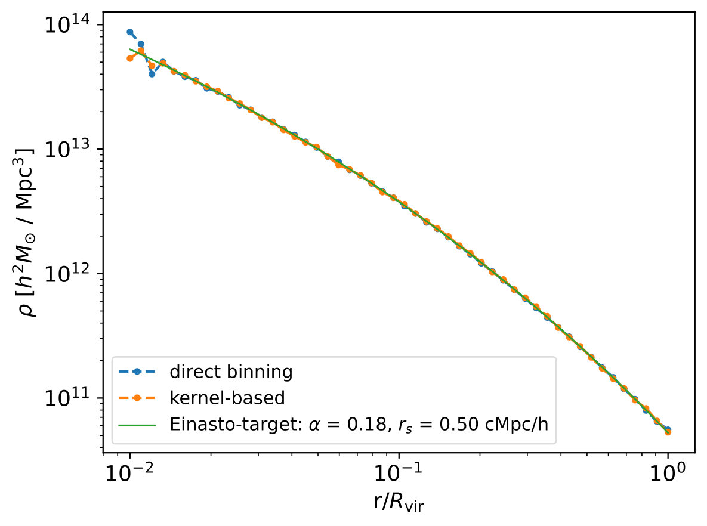
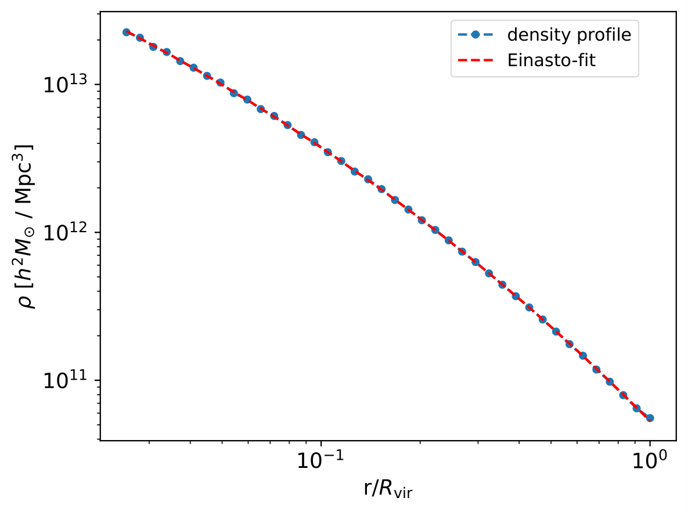

Density Profiles
========================

**************************
Density Profile Estimation
**************************

|pic0|

We have added density profile estimation capabilities. We contend ourselves with spherically averaged density profiles, which are thus defined with respect to the halocentric radius

.. math:: r = \sqrt{x^2+y^2+z^2},

where :math:`(x,y,z)` are the coordinates of a point cloud particle in some coordinate system centered on either the center of mass or the mode of the cloud. The density profile describes the radial mass distribution of the points in the cloud, e.g. in units of :math:`M_{\odot}h^2/(\mathrm{Mpc})^3` in the above plot. 

To estimate density profiles with CosmicProfiles, we first instantiate a ``DensProfsGadget`` object called ``cprofiles`` via::

    from cosmic_profiles import DensShapeProfsGadget, updateInUnitSystem, updateOutUnitSystem
    
    # Parameters
    updateInUnitSystem(length_in_cm = 'Mpc/h', mass_in_g = 'E+10Msun', velocity_in_cm_per_s = 1e5, little_h = 0.6774)
    updateOutUnitSystem(length_in_cm = 'Mpc/h', mass_in_g = 'Msun', velocity_in_cm_per_s = 1e5, little_h = 0.6774)
    SNAP_DEST = "/path/to/snapdir_035"
    GROUP_DEST = "/path/to/groups_035"
    SNAP = '035'
    OBJ_TYPE = 'dm'
    VIZ_DEST = "./viz"  # folder will be created if not present
    CAT_DEST = "./cat"
    RVIR_OR_R200 = 'R200'
    MIN_NUMBER_PTCS = 200
    CENTER = 'mode'

    # Instantiate object
    cprofiles = DensShapeProfsGadget(SNAP_DEST, GROUP_DEST, OBJ_TYPE, SNAP, VIZ_DEST, CAT_DEST, RVIR_OR_R200, MIN_NUMBER_PTCS, CENTER)

with arguments explained in the :ref:`Data Structures section<Data Structures>`. Now we can simply invoke the command::

    dens_profs_db = cprofiles.estDensProfs(r_over_r200, obj_numbers = np.arange(10), direct_binning = True, spherical = True, katz_config = default_katz_config),

where the float array ``dens_profs_db`` of shape :math:`(N_{\text{pass}}, N_r)` contains the estimated density profiles. The ``obj_numbers`` argument expects a list of integers indicating for which objects to estimate the density profile. In the example above, only the first 10 objects that have sufficient resolution will be considered, i.e. :math:`N_{\text{pass}}=10`, also see :ref:`Shape Estimation section<Shape Estimation>`. :math:`(N_{\text{pass}}, N_r)` further assumes that the float array that specifies for which unitless spherical radii ``r_over_r200`` the local density should be calculated, has shape :math:`N_r`. Specifying radial bins with equal spacing in logarithmic space :math:`\log (\delta r/r_{200}) = \mathrm{const}` is common practice, e.g. ``r_over_r200 = np.logspace(-1.5,0,70)``.

As the naming suggests, with ``direct_binning = True`` we estimate density profiles using a direct-binning approach, i.e. brute-force binning of particles into spherical shells and subsequent counting. The user also has the liberty to invoke an ellipsoidal shell-based density profile estimation algorithm by setting the boolean ``spherical = False``. See `Gonzalez et al. 2022 <https://arxiv.org/abs/2205.06827>`_ for an application of the ellipsoidal shell-based density profile estimation technique.

.. note:: If ``spherical = False``, the user then also has the discretion to set the configuration parameters ``katz_config`` for the Katz algorithm, explained in the :ref:`Shape Estimation section<Shape Estimation>`.

On the other hand, with ``direct_binning = False``, we perform a kernel-based density profile estimation, cf. `Reed et al. 2005 <https://academic.oup.com/mnras/article/357/1/82/1039256>`_. Kernel-based approaches allow estimation of profiles without excessive particle noise.

.. _Density Profile Fitting:

**************************
Density Profile Fitting
**************************

|pic1|

Apart from estimating density profiles using the direct-binning or the kernel-based approach, this package supports density profile fitting assuming a certain density profile model. Four different density profile models can be invoked. First, the NFW-profile (`Navarro et al. <https://ui.adsabs.harvard.edu/abs/1997ApJ...490..493N/abstract>`_) defined by

.. math:: \rho(r) = \frac{\rho_s}{(r/r_s)(1+r/r_s)^2}.

Secondly, the Hernquist profile (`Hernquist 1990 <https://ui.adsabs.harvard.edu/abs/1990ApJ...356..359H/abstract>`_) given by

.. math:: \rho(r) = \frac{\rho_s}{(r/r_s)(1+r/r_s)^3}.

Thirdly, the Einasto profile (`Einasto 1965 <https://ui.adsabs.harvard.edu/abs/1965TrAlm...5...87E/abstract>`_) defined by an additional parameter :math:`\alpha` via

.. math:: \rho(r) = \rho_s \exp\left(-\frac{2}{\alpha}\left[\left(\frac{r}{r_s}\right)^{\alpha}-1\right]\right).

Finally, the :math:`\alpha \beta \gamma` density profile (`Zhao 1996 <https://ui.adsabs.harvard.edu/abs/1996MNRAS.278..488Z/abstract>`_) is a generalization of the Navarro-Frank-White (NFW) halo density profile with the parametrization

.. math:: \rho(r) = \frac{\rho_s}{(r/r_s)^{\gamma}[1+(r/r_s)^{\alpha}]^{(\beta-\gamma)/\alpha}}.

To fit density profiles according to model ``method``, a dictionary whose ``profile`` field can be either ``nfw``, ``hernquist``, ``einasto`` or ``alpha_beta_gamma``, invoke the method::

    method = {'profile': 'einasto', 'alpha': 0.18}
    best_fits = cprofiles.fitDensProfs(dens_profs, r_over_r200, method, obj_numbers = np.arange(10)).

This will fit the density profiles using a truncated Newton (TNC) algorithm. The first argument ``dens_profs`` is an array of shape :math:`(N_{\text{pass}}, N_r)` containing the density profile estimates defined at normalized radii ``r_over_r200``. The last argument ``method = {'profile': 'einasto', 'alpha': 0.18}`` is a dictionary. The ``profile`` field is 1 of 4 possible strings corresponding to the density profile model, i.e. either ``nfw``, ``hernquist``, ``einasto`` or ``alpha_beta_gamma``.
If a parameter should be kept fixed during the fitting procedure, it needs to be supplied in the ``method`` dict. In the example above, the ``alpha`` parameter of the Einasto profile is fixed to ``0.18`` (giving approximately an NFW-profile).
The returned structured numpy array ``best_fits`` will store the best-fit results and its fields can be accessed by dictionary-like semantics, e.g. ``rho_s = best_fits['rho_s']`` (of shape :math:`(N_{\text{pass}},)`) will contain the density normalization of the best-fit profiles, ``r_s = best_fits['r_s']`` the scale radius etc. If ``method = 'alpha_beta_gamma'``, then ``alpha = best_fits['alpha']`` will contain the best-fit values for ``alpha`` etc.

Once density profiles have been fit, concentrations of objects can be calculated, defined as

.. math:: c = \frac{R_{200}}{r_s},

with :math:`r_s` the characteristic or scale radius of the corresponding density profile model. To this end, invoke::

    cs = cprofiles.estConcentrations(dens_profs, r_over_r200, method, obj_numbers = np.arange(10)),

which will return a float array ``cs`` of shape (:math:`N_{\text{pass}},`).

The density profiles, for instance ``dens_profs_db``, and their fits can be visualized using::

    cprofiles.plotDensProfs(dens_profs_db, r_over_r200, dens_profs_fit, r_over_r200_fit, method, nb_bins = 2, obj_numbers = np.arange(10))

where ``dens_profs_fit`` and ``r_over_r200_fit`` refer to those estimated density profile values that the user would like the fitting operation to be carried out over, e.g. ``dens_profs_fit = dens_profs_db[:,25:]`` and ``r_over_r200_fit = r_over_r200[25:]`` to discard the values that correspond to deep layers of halos/galaxies/objects. Typically, the gravitational softening scale times some factor and / or information from the local relaxation timescale is used to estimate the inner convergence radius. 
For guidance on choosing the inner convergence radius see e.g. `Navarro et al 2010 <https://academic.oup.com/mnras/article/402/1/21/1028856>`_ or `Ludlow et al 2019 <https://ui.adsabs.harvard.edu/abs/2019MNRAS.488.3663L/abstract`_.
