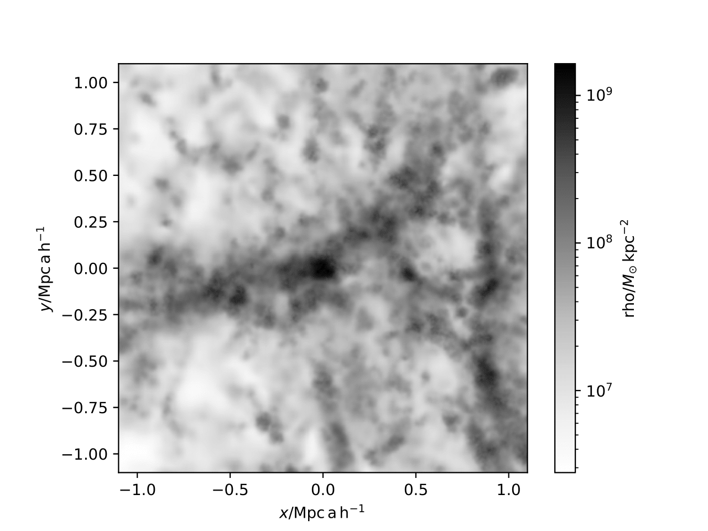

.. _AHF example:

AHF Example
============

|pic1|

In this example, we generate a mock universe, save the universe to a Gadget 2 file, load the Gadget 2 file with ``pynbody``, identify halos with AHF, and instantiate a ``cosmic_profiles`` object.

If ``pynbody.plot.image(halos[2].d, width = '500 kpc', cmap=plt.cm.Greys, units = 'Msol kpc^-2')`` fails, modify the argument ``cen_size`` in the ``center()`` function of ``/path/to/pynbody/analysis/halo.py`` to something like ``cen_size="10 kpc"``.

.. literalinclude :: ../../../example_scripts/apply_ahf.py
   :language: python
