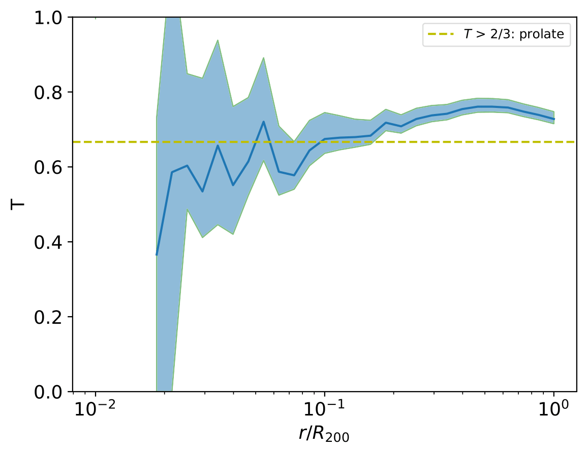

Gadget HDF5 Example
========================

|pic1| |pic2|

.. |pic1| image:: TCount_dm_035.png
   :width: 45%

In this example, we extract a central subhalo (CSH) catalogue from the FoF/SH data available in a Gadget HDF5 snapshot output and calculate all shape profiles.

.. literalinclude :: ../../../example_scripts/gadget3_hdf5.py
   :language: python
