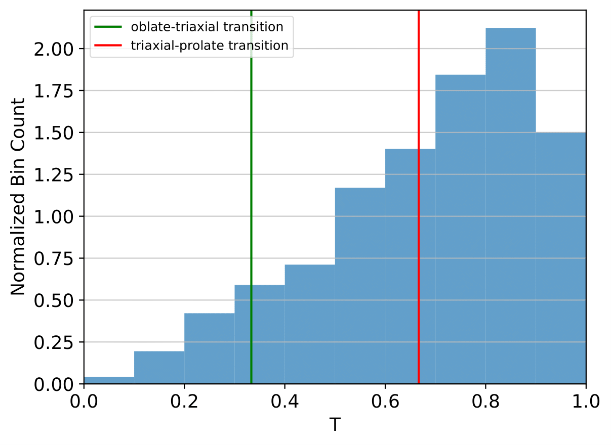
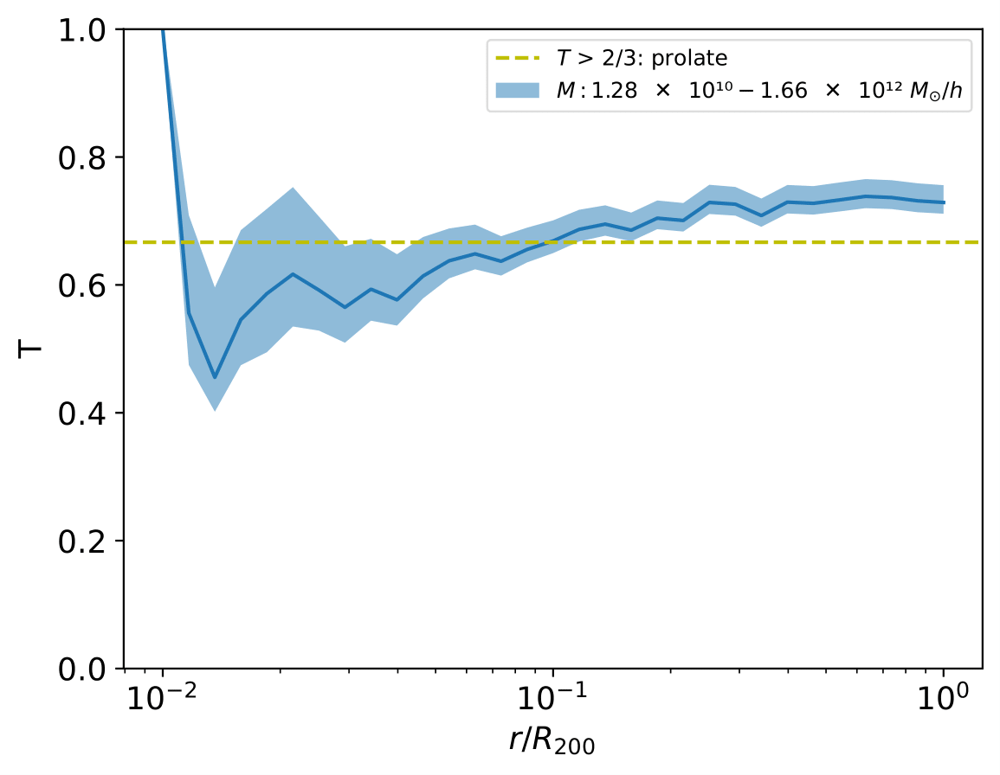
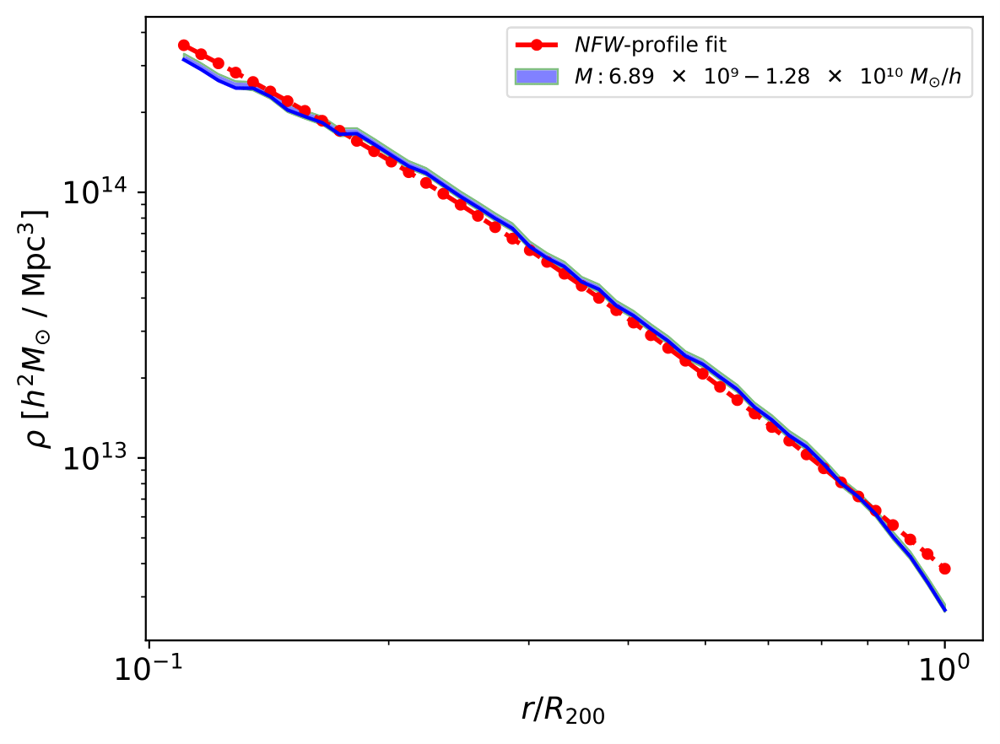

Gadget HDF5 Example
========================

|pic1| |pic2|

In this example, we extract a central subhalo (CSH) catalogue from the FoF/SH data available in a Gadget HDF5 snapshot output and calculate shape and mass density profiles, decomposed into mass bins.

.. literalinclude :: ../../../example_scripts/gadget3_hdf5.py
   :language: python
