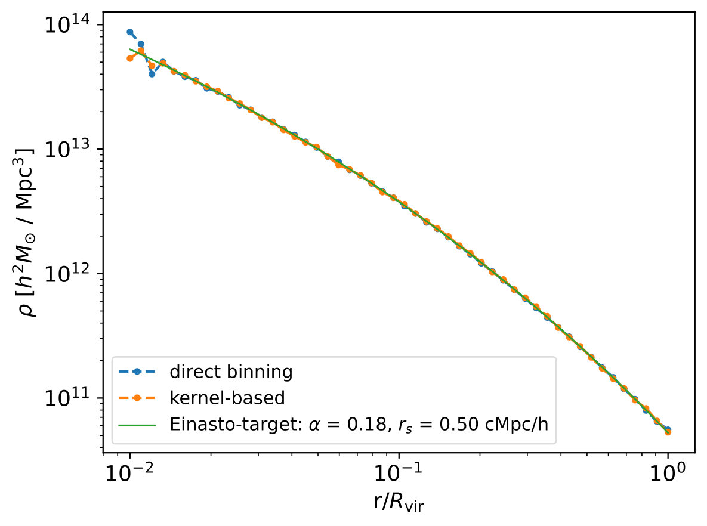

Mock Halo, Density Profile
============================

|pic1|

Here, we generate 1 mock halo and calculate its mass density profile.

.. literalinclude :: ../../../cosmic_profiles/tests/test_densities_ex_script.py
   :language: python
