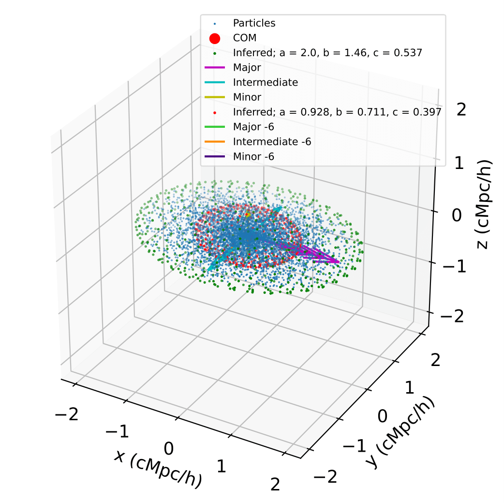

Mock Halo, Shape Profile
============================

|pic1|

Here, we generate 1 mock halo and calculate its shape profile.

.. literalinclude :: ../../../example_scripts/halo_gen_shapes.py
   :language: python

.. note:: An entire mock halo catalogue can be generated by invoking ``genHalo()`` multiple times with the preferred arguments.
