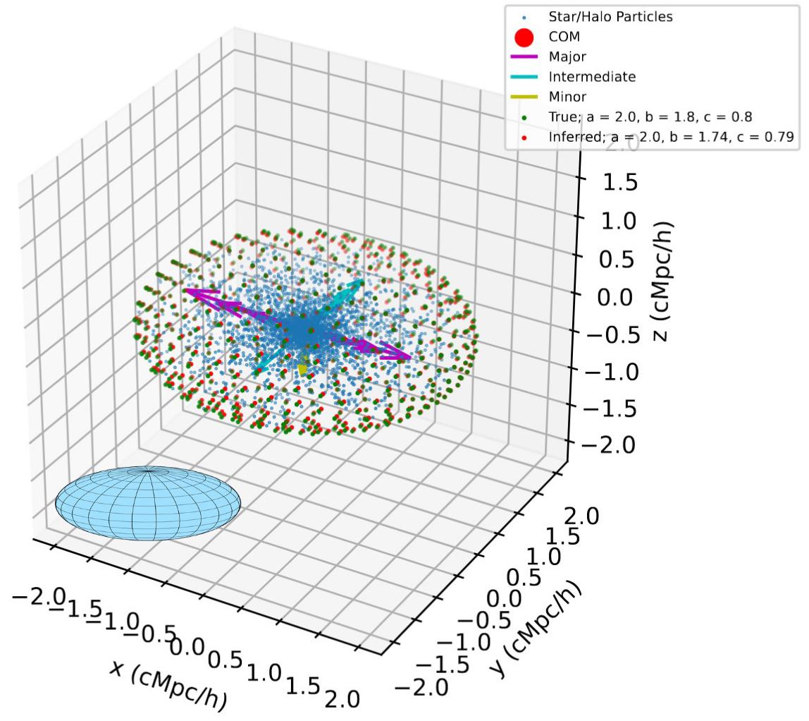
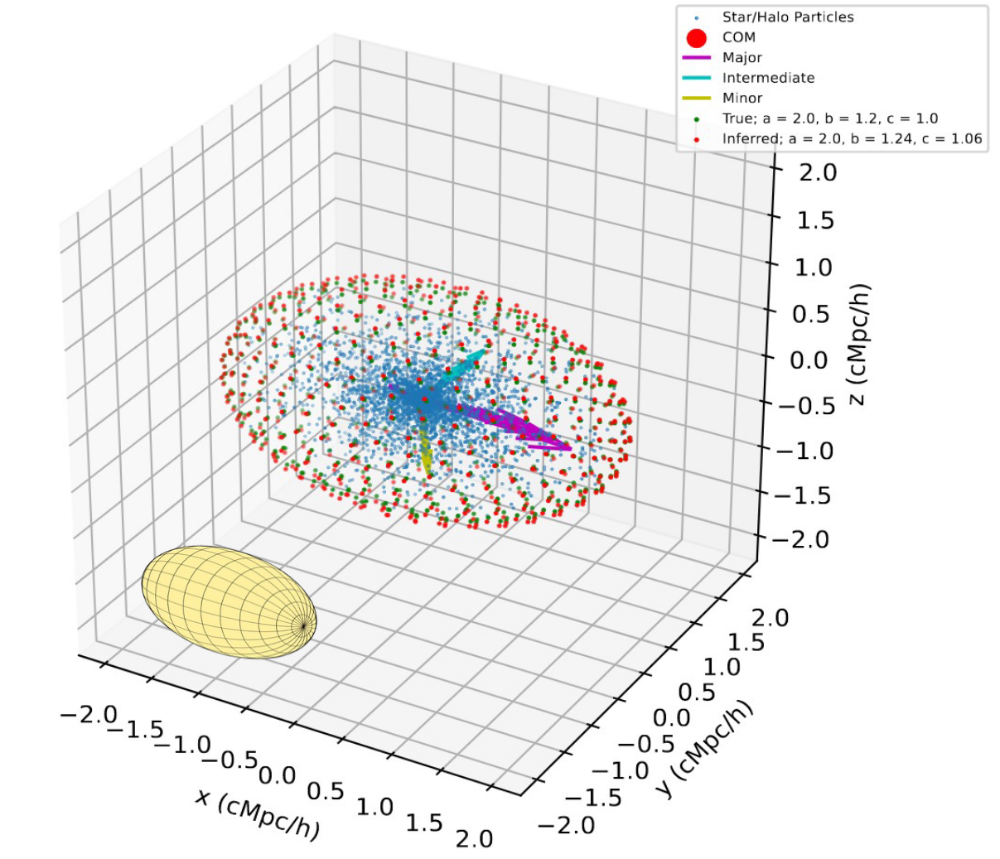

Mock Halo Generator
========================

|pic1| |pic2|

We provide a mock halo generator in the function ``genHalo(tot_mass, res, model_pars, method, a, b, c)`` documented in :ref:`the code reference<Cosmic Profiles Code Reference>`. The invokation will create a mock halo of mass ``tot_mass`` consisting of approximately ``res`` particles. Four different density profile models can be invoked, explained in the :ref:`Density Profile Fitting section<Density Profile Fitting>`.
    
The function ``genHalo(tot_mass, res, model_pars, method, a, b, c)`` will sample halo particles from the density profile specified by ``method`` with the model parameters provided as a dictionary ``model_pars`` while the principal axis ratios between `a`, `b` and `c` are required to be constant across `r` = :math:`r_{\text{ell}}` = `a`. The following snippet samples a halo from a :math:`\alpha \beta \gamma`-density distribution with parameters ``r_s`` = 1, ``alpha`` = 1, ``beta`` = 3, ``gamma`` = 1. The larger ``res``, the higher the halo resolution.

.. code-block:: python

    from cosmic_profiles import genHalo
    
    # Generate 1 mock halo
    tot_mass = 10**(12) # M_sun/h
    res = 500000
    r_s = 0.3 # in units of Mpc/h
    alpha = 1; beta = 3; gamma = 1
    N_bin = 20
    r_vir = 2 # in units of Mpc/h
    a = np.logspace(-2,0.2,N_bin)*r_vir
    b = a*0.2 
    c = a*0.2 # This will be a prolate halo
    method = 'alpha_beta_gamma'
    model_pars = {'alpha': alpha, 'beta': beta, 'gamma': gamma, 'r_s': r_s])

    halo_x, halo_y, halo_z, mass_ptc, rho_0 = genHalo(tot_mass, res, model_pars, method, a, b, c)

.. warning:: ``genHalo()`` expects ``tot_mass`` to be in units of :math:`M_{\odot}/h` while ``a``, ``b`` and ``c`` is expected to be in units of Mpc/:math:`h`.

.. note:: The profile parameter ``rho_s`` will be calculated on the fly within ``genHalo(tot_mass, res, model_pars, method, a, b, c)`` from ``tot_mass`` and the other model parameters, so there is no need to provide that in ``model_pars``.
