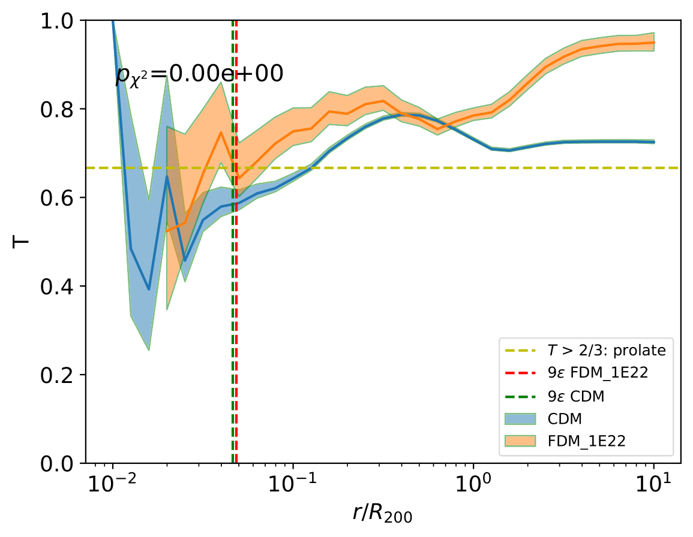
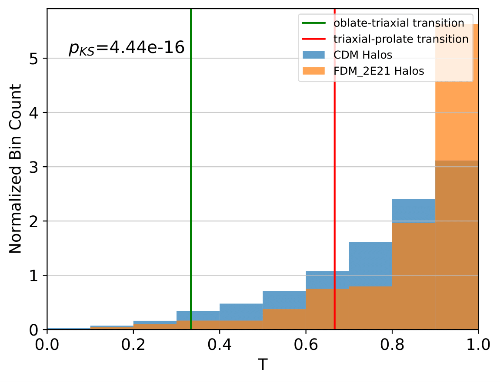

.. _Shape Estimation:

Local and Global Shape Estimation
=================================

|pic1| |pic2|

***************
Shape Profiles
***************

Shape profiles depict the ellipsoidal shape of a point cloud as a function of the ellipsoidal radius

.. math:: r_{\text{ell}} = \sqrt{x_{\text{ell}}^2+\frac{y_{\text{ell}}^2}{(b/a)^2}+\frac{z_{\text{ell}}^2}{(c/a)^2}},

where :math:`(x_{\text{ell}},y_{\text{ell}},z_{\text{ell}})` are the coordinates of a point cloud particle in the eigenvector coordinate system of the ellipsoid (= principal frame), i.e., :math:`r_{\text{ell}}` corresponds to the semi-major axis :math:`a` of the ellipsoidal surface on which that particle lies.

The shape as a function of ellipsoidal radius can be described by the axis ratios

.. math:: q = \frac{b}{r_{\text{ell}}}, \ \ s = \frac{c}{r_{\text{ell}}},

where :math:`b` and :math:`c` are the eigenvalues corresponding to the intermediate and minor axes, respectively. The ratio of the minor-to-major axis :math:`s` has traditionally been used as a canonical measure of the distribution's sphericity. A frequently quoted shape parameter is the triaxiality

.. math:: T = \frac{1-q^2}{1-s^2},

which measures the prolateness/oblateness of a halo. :math:`T = 1` describes a completely prolate halo, while :math:`T = 0` describes a completely oblate halo. Halos with :math:`0.33 < T < 0.67` are said to be triaxial. The axis ratios can be computed from the shape tensor :math:`S_{ij}`, which is the second moment of the mass distribution divided by the total mass:

.. math:: S_{ij} = \frac{1}{\sum_k m_k} \sum_k w_k m_k r_{k,i}r_{k,j}.

Here, :math:`m_k` is the mass of the :math:`k`-th particle, and :math:`r_{k} = (x_{k},y_{k},z_{k})^t` is the position vector with respect to the distribution's center (either mode or center of mass). The weight :math:`w_k` allows to define the most common shape tensors by choosing

* :math:`w_k = 1`, in which case each particle gets the same weight, or
* :math:`w_k = \frac{1}{r_k^2}` where :math:`r_k^2 = (x_{k})^2+(y_{k})^2+(z_{k})^2` is the distance squared of particle :math:`k` from the center of the cloud, or
* :math:`w_k = \frac{1}{r_{\text{ell},k}^2}` where :math:`r_{\text{ell},k}^2 = x_{\text{ell},k}^2+y_{\text{ell},k}^2+z_{\text{ell},k}^2` is the ellipsoidal radius, where :math:`(x_{\text{ell},k}, y_{\text{ell},k}, z_{\text{ell},k})` are the coordinates of particle :math:`k` in the eigenvector coordinate system of the ellipsoid. The shape tensor with :math:`w_k = \frac{1}{r_{\text{ell},k}^2}` is also called the *reduced* shape tensor, a variant that penalizes particles at large radii.

Since the second weighting scheme with :math:`w_k = \frac{1}{r_k^2}` has recently fallen out of favour, see `Zemp et al. 2011 <https://arxiv.org/abs/1107.5582>`_, the other two schemes will be available by switching the boolean ``reduced``, see below.

After instantiating an object ``cprofiles`` as outlined in :ref:`Data Structures section<Data Structures>`, one can calculate and retrieve the local (i.e. as a function of :math:`r_{\text{ell}}`) halo shape catalogue by::

    d, q, s, minor, inter, major, obj_centers, obj_masses = cprofiles.getShapeCatLocal(select = [0, 9], reduced = False, shell_based = False).

The morphological information in ``d``, ``q``, ``s``, ``minor``, ``inter`` and ``major`` represents the shape profiles while ``obj_centers`` and ``obj_masses`` refer to object centers and total masses, respectively. The ``select`` argument expects a list of two integers indicating for which objects to estimate the density profile. In the example above, only the first 10 objects that have sufficient resolution will be considered. Typically, the ordering of objects internally is such that this will select the 10 most massive objects. The boolean ``reduced`` allows to select between the reduced shape tensor with weight :math:`w_k = \frac{1}{r_{\text{ell},k}^2}` and the regular shape tensor with :math:`w_k = 1`. The boolean ``shell_based`` allows to run the iterative shape identifier on ellipsoidal shells (= homoeoids) rather than ellipsoids. Note that ``shell_based = True`` should only be set if the number of particles resolving the objects is :math:`> \mathcal{O}(10^5)`. 

.. warning:: The arrays ``d``, ``q``, ``s``, ``minor``, ``inter`` and ``major`` will contain NaNs whenever the shape determination does not converge. We consider the shape determination at a specific :math:`r_{\text{ell}}` to be converged if the fractional difference between consecutive eigenvalue fractions falls below ``IT_TOL`` and the maximum number of iterations ``IT_WALL`` is not yet achieved.

If :math:`N_{\text{pass}}` stands for the number of objects that have been selected with the ``select`` argument and in addition are sufficiently resolved, then the 1D and 2D shape profile arrays will have the following format:

* ``d`` of shape (:math:`N_{\text{pass}}`, ``D_BINS`` + 1): ellipsoidal radii
* ``q`` of shape (:math:`N_{\text{pass}}`, ``D_BINS`` + 1): q shape parameter
* ``s`` of shape (:math:`N_{\text{pass}}`, ``D_BINS`` + 1): s shape parameter
* ``minor`` of shape (:math:`N_{\text{pass}}`, ``D_BINS`` + 1, 3): minor axes vs :math:`r_{\text{ell}}`
* ``inter`` of shape (:math:`N_{\text{pass}}`, ``D_BINS`` + 1, 3): intermediate axes vs :math:`r_{\text{ell}}`
* ``major`` of shape (:math:`N_{\text{pass}}`, ``D_BINS`` + 1, 3): major axes vs :math:`r_{\text{ell}}`
* ``obj_centers`` of shape (:math:`N_{\text{pass}}`,3): centers of objects 
* ``obj_masses`` of shape (:math:`N_{\text{pass}}`,): masses of objects.

For post-processing purposes, one can dump the shape profiles in a destination ``CAT_DEST`` of choice via::
    
    cprofiles.dumpShapeCatLocal(CAT_DEST, select = [0, 9], reduced = False, shell_based = False),

where ``CAT_DEST`` is a string describing the absolute (or relative with respect to Python working diretory) path to the destination folder, e.g. ``/path/to/cat``  (will be created if missing).

.. dropdown:: Shape Profiles, Dumped Files

    * ``d_local_x.txt`` (``x`` being the snap string ``SNAP``) of shape (:math:`N_{\text{pass}}`, ``D_BINS`` + 1): ellipsoidal radii
    * ``q_local_x.txt`` of shape (:math:`N_{\text{pass}}`, ``D_BINS`` + 1): q shape parameter
    * ``s_local_x.txt`` of shape (:math:`N_{\text{pass}}`, ``D_BINS`` + 1): s shape parameter
    * ``minor_local_x.txt`` of shape (:math:`N_{\text{pass}}`, (``D_BINS`` + 1) * 3): minor axes vs :math:`r_{\text{ell}}`, have to apply ``minor_local_x.reshape(minor_local_x.shape[0], minor_local_x.shape[1]//3, 3)`` after loading with np.loadtxt()
    * ``inter_local_x.txt`` of shape (:math:`N_{\text{pass}}`, (``D_BINS`` + 1) * 3): intermediate axes vs :math:`r_{\text{ell}}`, same here
    * ``major_local_x.txt`` of shape (:math:`N_{\text{pass}}`, (``D_BINS`` + 1) * 3): major axes vs :math:`r_{\text{ell}}`, same here
    * ``m_x.txt`` of shape (:math:`N_{\text{pass}}`,): masses of halos
    * ``centers_x.txt`` of shape (:math:`N_{\text{pass}}`,3): centers of halos

.. note:: In case of a Gadget-style HDF5 snapshot output, specify ``OBJ_TYPE = 'dm'`` to calculate local dark matter halo shapes (only the dark matter component of halos), ``OBJ_TYPE = 'gas'`` to calculate the local shapes of gas particles inside halos and ``OBJ_TYPE = 'stars'`` to calculate the local shapes of star particles inside halos. The suffix of the output files will be modified accordingly to e.g. ``d_local_gas_x.txt``.

***************
Global Shapes
***************

Instead of shape profiles one might also be interested in obtaining the shape parameters and principal axes of the point clouds as a whole. This information can be obtained by calling::

    d, q, s, minor, inter, major, obj_centers, obj_masses = cprofiles.getShapeCatGlobal(select = [0, 9], reduced = False).

If a global shape calculations does not converge (which is rare), the corresponding entry in ``q`` etc. will feature a NaN. As with shape profiles, we can dump the global shape catalogue in a destination ``CAT_DEST`` of choice via::

    cprofiles.dumpShapeCatGlobal(CAT_DEST, reduced = False),

which will some files to the destination folder.

.. dropdown:: Global Shapes, Dumped Files

    * ``d_global_x.txt`` (``x`` being the snap string ``SNAP``) of shape (:math:`N_{\text{pass}}`,): ellipsoidal radii
    * ``q_global_x.txt`` of shape (:math:`N_{\text{pass}}`,): q shape parameter
    * ``s_global_x.txt`` of shape (:math:`N_{\text{pass}}`,): s shape parameter
    * ``minor_global_x.txt`` of shape (:math:`N_{\text{pass}}`, 3): minor axis
    * ``inter_global_x.txt`` of shape (:math:`N_{\text{pass}}`, 3): intermediate axis
    * ``major_global_x.txt`` of shape (:math:`N_{\text{pass}}`, 3): major axis
    * ``m_x.txt`` of shape (:math:`N_{\text{pass}}`,): masses of halos
    * ``centers_x.txt`` of shape (:math:`N_{\text{pass}}`,3): centers of halos

.. note:: As previously, :math:`N_{\text{pass}}` denotes the number of halos that have been selected with the ``select`` argument *and* pass the ``MIN_NUMBER_PTCS``-threshold. If the global shape determination for a sufficiently resolved object does not converge, it will appear as NaNs in the output.

*************************************
Velocity Dispersion Tensor Eigenaxes
*************************************

For Gadget-style HDF5 snapshot outputs one can calculate the velocity dispersion tensor eigenaxes by calling::

    d, q, s, minor, inter, major, obj_centers, obj_masses = cprofiles.getShapeCatVelLocal(select = [0, 9], reduced = False, shell_based = False)

for local velocity shapes or ``cprofiles.getShapeCatVelGlobal(select = [0, 9], reduced = False)`` for global velocity shapes. When calling e.g. ``cprofiles.dumpShapeCatVelGlobal(CAT_DEST, select = [0, 9], reduced = False)``, the overall halo velocity dispersion tensor shapes of the following format will be added to ``CAT_DEST``.

.. dropdown:: Velocity Shapes, Dumped Files

    * ``d_global_vdm_x.txt`` (``x`` being the snap string ``SNAP``) of shape (:math:`N_{\text{pass}}`,): ellipsoidal radii
    * ``q_global_vdm_x.txt`` of shape (:math:`N_{\text{pass}}`,): q shape parameter
    * ``s_global_vdm_x.txt`` of shape (:math:`N_{\text{pass}}`,): s shape parameter
    * ``minor_global_vdm_x.txt`` of shape (:math:`N_{\text{pass}}`, 3): minor axis
    * ``inter_global_vdm_x.txt`` of shape (:math:`N_{\text{pass}}`, 3): intermediate axis
    * ``major_global_vdm_x.txt`` of shape (:math:`N_{\text{pass}}`, 3): major axis
    * ``m_vdm_x.txt`` of shape (:math:`N_{\text{pass}}`,): masses of halos
    * ``centers_vdm_x.txt`` of shape (:math:`N_{\text{pass}}`,3): centers of halos

The ``cprofiles.dumpShapeCatVelLocal(CAT_DEST, select = [0, 9], reduced = False)`` command will dump files named ``d_local_vdm_x.txt`` etc.

*************************************
Visualizations
*************************************

Shape profiles can be visualized using::

    cprofiles.plotShapeProfs(nb_bins = 2, VIZ_DEST = VIZ_DEST, select = [0, 9], reduced = False, shell_based = False)

which draws median shape profiles and also mass bin-decomposed ones. ``nb_bins`` stand for the number of mass bins to plot density profiles for. 3D visualizations of individual halos can be accomplished using::
 
    cprofiles.vizLocalShapes(obj_numbers = [0,1,2], VIZ_DEST = VIZ_DEST, reduced = False, shell_based = False)

which for instance would visualize the 3D distribution of particles as well as the eigenaxes at two different ellipsoidal radii in the first three objects that have sufficient resolution. ``VIZ_DEST`` is a string describing the absolute (or relative with respect to Python working diretory) path to the visualization folder, e.g. ``/path/to/viz`` (will be created if missing).